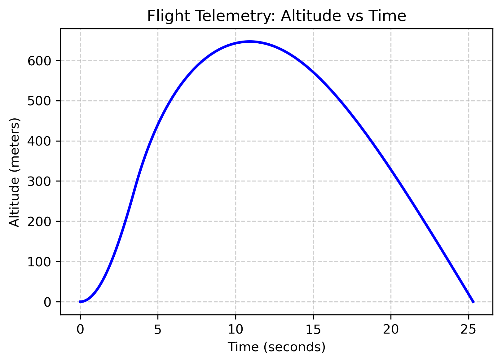
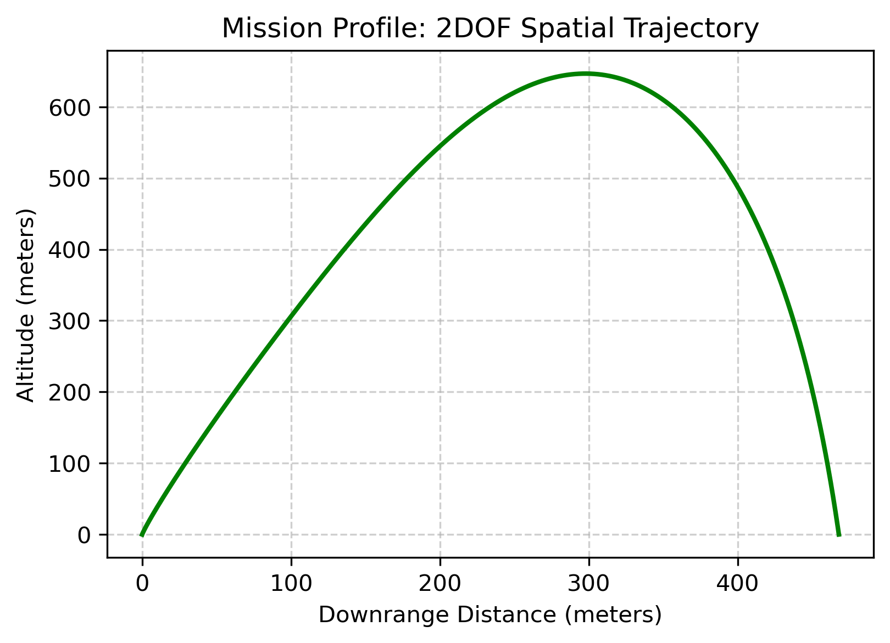

## Mission Control Suite  `/mission-control`

| Module | Status | Description |
|---|---|---|
| `propagator/` | In Progress | 3DOF RK4 trajectory propagator with drag and gravity models |
| `state-estimator/` | Planned | Extended Kalman Filter for 6-DOF state estimation |
| `monte-carlo/` | Planned | Dispersion analysis — 1000+ runs, landing footprint scatter plots |
| `ground-station/` | Planned | Flask dashboard, MQTT telemetry receiver, real-time visualisation |

### 3DOF Trajectory Propagator Engine

The core analytical engine of the Mission Control Suite predicts suborbital flight profiles by evaluating instantaneous flight dynamics. Instead of assuming constant acceleration, the solver evaluates changing force boundaries across discrete time steps ($\Delta t = 0.01\text{s}$) using a 4th-Order Runge-Kutta numerical integrator.

For a given kinematic state vector $\mathbf{x} = [x, y, z, v_x, v_y, v_z]^T$, the solver computes four distinct intermediate derivative vectors ($k_1, k_2, k_3, k_4$) to approximate the state update with high-order local accuracy with local accuracy of $\mathcal{O}(\Delta t^5)$:

$$k_1 = f(t, \mathbf{x})$$
$$k_2 = f\left(t + \frac{\Delta t}{2}, \mathbf{x} + \frac{\Delta t}{2}k_1\right)$$
$$k_3 = f\left(t + \frac{\Delta t}{2}, \mathbf{x} + \frac{\Delta t}{2}k_2\right)$$
$$k_4 = f(t + \Delta t, \mathbf{x} + \Delta t k_3)$$

$$\mathbf{x}_{n+1} = \mathbf{x}_n + \frac{\Delta t}{6}(k_1 + 2k_2 + 2k_3 + k_4)$$

#### Active Vector Force Models

1. **Gravitational Vector** ($\mathbf{F}_g$): Acts downwards along the local vertical axis:

$$\mathbf{F}_g = \begin{bmatrix} 0 \\ 0 \\ -m \cdot g_0 \end{bmatrix}$$

2. **Aerodynamic Drag Vector** ($\mathbf{F}_D$): Directed exactly opposite to the instantaneous velocity unit vector ($\hat{v}$). It references an exponential atmospheric density decay model based on altitude:

$$\mathbf{F}_D = -\frac{1}{2} \rho(z) \|\mathbf{v}\|^2 C_D A \cdot \left(\frac{\mathbf{v}}{\|\mathbf{v}\|}\right)$$

 $$\rho(z) = \rho_0 \cdot e^{-z/h_{scale}}$$  

3. **Mass Depletion Curve ($\dot{m}$):** During the powered phase ($t < 3.5\text{s}$), vehicle mass updates continuously as propellant is exhausted ($m(t) = m_{dry} + m_{prop} - \dot{m}t$). Because the nominal thrust remains constant while the vehicle mass strips away, the rocket experiences an escalating thrust-to-weight ratio, causing a characteristic spike in acceleration immediately prior to motor burnout.

---

### Verification and Operational Profiles

Below are the analytical outputs generated from a baseline sounding rocket profile configuration (Dry Mass: 1.0 kg, Propellant: 0.3 kg, Nominal Thrust: 80 N, Burn Time: 3.5s) launches at an initial pitch angle of $85^\circ$.
| 1. Altitude Telemetry Matrix | 2. Downrange Spatial Profile (X vs Z) |
|---|---|
|  |  |
| **Analysis:** Tracks transition from active booster burn to a ballistic coast phase. Peak operational apogee of **~700 meters** is achieved at $t \approx 11.5\text{s}$. | **Analysis:** Maps the actual 2D path across the range. Tilted lift-off vectors result in a terminal impact coordinate **~460 meters** downrange from the launch pad. |

---

## Flight Computer Firmware  `/firmware`

**Active development:** `firmware/flight-computer/`
- Custom MPU6050 driver (ESP-IDF v5.2 Master Bus API, I2C at 400kHz)
- I2C integrity validation via WHO_AM_I handshake (`0x68` signature)
- Voltage divider ($1k\Omega / 2.2k\Omega$) for 5V→3.3V HC-SR04 logic level protection
- StateMachine: `IDLE → PRE_FLIGHT → ACTIVE → DESCENT → LANDED`
- Custom Vector3D class using zero dynamic memory allocation

`mission-control/propagator/targeter.py`
- iterative root-finding target to adjust launch angle

**Archived experiments:** `firmware/archive/` — early drivers and learning exercises

## Tech Stack

**Flight Computer:** Embedded C++ · ESP-IDF v5.2 · FreeRTOS · ESP32-WROOM  
**Mission Control:** Python · NumPy/SciPy · Matplotlib · Paho MQTT · Flask  
**Hardware:** ESP32-WROOM · MPU6050 · BMP280 · HC-SR04 · Raspberry Pi 5

## Dev Logs

Session notes in `/docs/dev-logs/` — tracking progress, debugging decisions, 
and physics derivations as the project grows.

---
